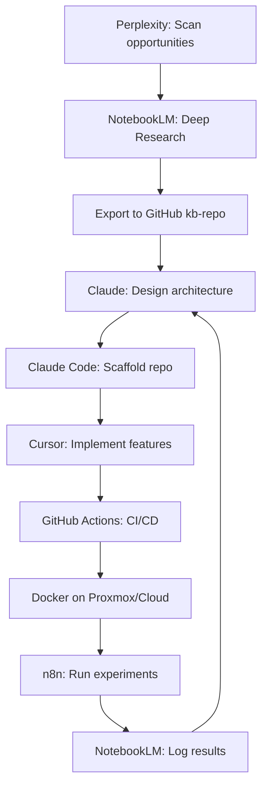
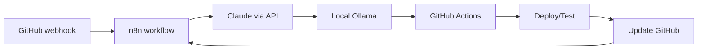

# HeliOS Studio Architecture

## System Design

HeliOS Studio is designed as a layered AI development ecosystem where each layer has specific responsibilities and integrates with adjacent layers through well-defined interfaces.

## Layered Architecture

### Discovery Layer

**Purpose**: Scan the internet for opportunities, trends, and problems to solve.

**Tools**:
- **Perplexity AI**: Primary opportunity discovery and market research
  - Use Collections to organize research by theme (cybersecurity, devtools, automation)
  - Export promising findings to NotebookLM for deeper analysis

**Outputs**: Links, briefs, opportunity summaries

### Knowledge Layer

**Purpose**: Persistent, searchable knowledge base for research, documentation, and learning.

**Tools**:
- **NotebookLM**: Central research notebook
  - Deep Research for comprehensive topic analysis
  - Supports PDFs, URLs, Google Docs, YouTube, images
  - Generates summaries, timelines, mind maps, audio, video, flashcards
- **GitHub Knowledge Repos**: Versioned, organized storage
  - `kb-opportunities-<theme>` - opportunity notes and market analysis
  - `kb-tech-<topic>` - technical research
  - `kb-feeds` - raw research feeds

**Integration**: NotebookLM exports → GitHub repos via manual workflow (later automated with n8n + Google Drive API)

### Reasoning Layer

**Purpose**: System design, planning, analysis, and architectural decision-making.

**Tools**:
- **Claude (web/Desktop)**: Primary architect
  - System design, threat modeling, trade-off analysis
  - ADRs, RFCs, architecture diagrams, test strategies
  - MCP-enabled for tool access
- **Claude Code**: Repo-aware planning and large refactors
  - Codebase navigation and analysis
  - Multi-file refactors
  - GitHub automation via MCP
- **Local LLMs (reasoning models)**: Offline reasoning
  - DeepSeek, Qwen3 thinking variants
  - Private analysis of sensitive data

**Integration**: MCP tools connect Claude to GitHub, filesystem, n8n, and Ollama

### Coding Layer

**Purpose**: Write, refactor, and test code with AI assistance.

**Tools**:
- **Cursor** (primary): AI-native editor
  - Full repo indexing (272k+ token context)
  - Multi-file edits via Composer
  - Model selection per task (Claude, GPT, Gemini)
- **VS Code** (retained): Infrastructure scripting
  - Existing extensions and workflows
  - GitHub Copilot integration
- **Claude Code** (outside IDE): Cross-repo automation
  - Migration scripts
  - Batch operations across multiple repos

**Integration**: Local Ollama API for inline assistance; GitHub for version control

### Local AI Layer

**Purpose**: Cost-effective, private inference for coding, summarization, and background tasks.

**Tools**:
- **Ollama**: Standard local runtime
  - 100+ models available
  - OpenAI-compatible API

**Recommended Models**:
- **General**: Llama 3/4 8-14B, Qwen3 4-7B
- **Coding**: Qwen3-Coder variants
- **Tiny/utility**: Phi-3 Mini (~3.8B) for fast CPU tasks
- **Multimodal**: Llama 4, Gemma 3, Qwen vision variants

**Use Cases**:
- Private log analysis
- Quick documentation summarization
- Offline coding help
- Cheap batch experiments

### Automation Layer

**Purpose**: Orchestrate workflows between tools without manual intervention.

**Tools**:
- **n8n (self-hosted)**: Visual automation platform
  - GitHub webhooks → workflows
  - Scheduled research captures
  - AI nodes for enrichment
  - Experiment orchestration
- **MCP Tools**: Standardized tool interfaces
  - GitHub MCP server (issues, PRs, repos)
  - Filesystem MCP (sandboxed file ops)
  - n8n MCP (trigger workflows, check status)
  - Ollama MCP (local inference)

**Integration**: n8n triggers GitHub Actions; MCP tools called by Claude/Claude Code

### Infrastructure Layer

**Purpose**: Deploy, host, and operate projects.

**Tools**:
- **GitHub**: Source of truth, Issues/Projects as work board, CI via Actions
- **Docker + docker-compose**: Container orchestration
- **Proxmox**: Homelab virtualization
  - VM 1: AI Core (Ollama, vector DBs, orchestrator APIs)
  - VM 2: Automation Hub (n8n, webhooks, monitoring)
  - VM 3+: Self-hosted GitHub runners, prototype deployments, observability
- **Cloud**: Minimal VPS/container instances for public endpoints

## Data Flow

### Opportunity Discovery → Deployment

### Automation Loop

## Integration Points

### MCP (Model Context Protocol)

MCP provides Claude and Claude Code with standardized access to:
- **Filesystem**: Scoped to `/workspace` directory
- **GitHub**: Fine-grained tokens for specific orgs/repos
- **n8n**: Trigger workflows, query status
- **Ollama**: Local model inference

**Security**: Each MCP server runs sandboxed, with least-privilege access

### APIs and Webhooks

- **GitHub webhooks** → n8n for event-driven automation
- **Ollama API** (OpenAI-compatible) for local inference
- **NotebookLM** via Google Drive API (future) for automated exports
- **Perplexity API** (when available) for programmatic research

## Design Principles

1. **GitHub as control plane**: All work tracked in Issues/Projects; repos are source of truth
2. **AI as team member**: Each AI tool has a defined role and scope
3. **Local-first where possible**: Use local models for cheap, private tasks; cloud for frontier capabilities
4. **Explicit handoffs**: Workflows define when and how data moves between tools
5. **Security by design**: Strong compartmentalization, least privilege, audit logging

## Scalability Path

- **Phase 1**: Manual workflows, single user
- **Phase 2**: Automated handoffs via n8n, MCP tools
- **Phase 3**: Multi-project orchestration, experiment pipelines
- **Phase 4**: Community/team features, shared templates

## Next Steps

See [SETUP_GUIDE.md](SETUP_GUIDE.md) for implementation.
