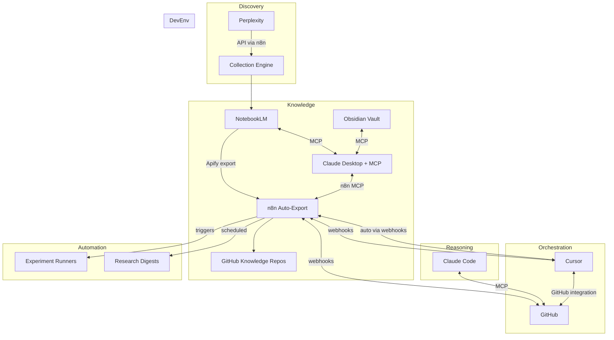

# Tool Integrations & Direct Connections

> **Last Updated:** March 9, 2026  
> **Status:** Active ecosystem - review monthly for new capabilities

This guide documents the direct integrations between core HeliOS-Studio tools that eliminate manual handoffs and enable true AI-powered automation.

## Overview

The ecosystem has matured significantly with MCP (Model Context Protocol) servers and native API integrations that allow tools to communicate directly:



## Critical MCP Servers

### 1. n8n MCP Server

**Enables:** Claude can build, validate, and deploy n8n workflows conversationally

**Installation:**
```bash
npm install -g @n8n-io/mcp-server
```

**Claude Desktop config** (`~/.config/Claude/claude_desktop_config.json`):
```json
{
  "mcpServers": {
    "n8n": {
      "command": "npx",
      "args": ["-y", "@n8n-io/mcp-server"],
      "env": {
        "N8N_API_KEY": "your-n8n-api-key",
        "N8N_BASE_URL": "http://localhost:5678"
      }
    }
  }
}
```

**Capabilities:**
- List all workflows
- Get workflow details and execution history
- Create/update workflows from natural language
- Validate workflow logic before deployment
- Trigger workflows with parameters
- Access 525+ n8n node templates

**Use case:** "Claude, build me an n8n workflow that monitors GitHub issues labeled 'experiment' and triggers my prototype's /test endpoint every hour"

**Sources:** [czlonkowski/n8n-mcp](https://github.com/czlonkowski/n8n-mcp), [n8n community](https://community.n8n.io/t/i-built-an-mcp-server-that-makes-claude-an-n8n-expert-heres-how-it-changed-everything/133902)

---

### 2. NotebookLM MCP Server (Unofficial)

**Enables:** Claude can query, search, and manage NotebookLM notebooks directly

**Installation (choose one):**

**Option A: roomi-fields variant** (basic):
```bash
npm install -g notebooklm-mcp
```

**Option B: Pantheon-Security variant** (enhanced security):
```bash
git clone https://github.com/Pantheon-Security/notebooklm-mcp-secure
cd notebooklm-mcp-secure
npm install
npm run build
```

**Claude Desktop config:**
```json
{
  "mcpServers": {
    "notebooklm": {
      "command": "node",
      "args": ["/path/to/notebooklm-mcp/dist/index.js"],
      "env": {
        "NOTEBOOKLM_AUTH_TOKEN": "your-google-auth-token"
      }
    }
  }
}
```

**Capabilities:**
- List all notebooks
- Search across notebook content
- Query specific notebooks for information
- Get source citations
- Add new sources to notebooks (via unofficial API)
- Export notebook summaries

**Use case:** "Claude, search my NotebookLM 'MCP Security Research' notebook for vulnerabilities related to token passthrough and summarize findings"

**Sources:** [mcpservers.org/notebooklm](https://mcpservers.org/servers/roomi-fields/notebooklm-mcp), [Pantheon-Security/notebooklm-mcp-secure](https://github.com/Pantheon-Security/notebooklm-mcp-secure)

**⚠️ Note:** NotebookLM official API is not yet public (as of March 2026). These servers use browser automation or unofficial endpoints.

---

### 3. Obsidian MCP Server

**Enables:** Claude can read/write your local markdown knowledge vault

**Installation:**
```bash
npm install -g @smithery/mcp-obsidian
```

**Claude Desktop config:**
```json
{
  "mcpServers": {
    "obsidian": {
      "command": "npx",
      "args": ["-y", "@smithery/mcp-obsidian"],
      "env": {
        "OBSIDIAN_VAULT_PATH": "/home/user/obsidian-vault"
      }
    }
  }
}
```

**Capabilities:**
- Search notes by title or content
- Read full note content
- Create new notes
- Update existing notes
- List notes in folders
- Follow wiki-links and backlinks

**Use case:** "Claude, check my Obsidian vault for any notes on 'threat modeling MCP servers' and create a new note summarizing best practices from HeliOS-Studio research"

**Sources:** [smithery-ai/mcp-obsidian](https://github.com/smithery-ai/mcp-obsidian), [Obsidian forum](https://forum.obsidian.md/t/automate-note-generation-in-obsidian-with-claude-desktop-and-mcp-servers/99542)

---

### 4. GitHub MCP Server (Official)

**Enables:** Claude can manage repos, issues, PRs, and run queries

**Installation:**
```bash
npm install -g @modelcontextprotocol/server-github
```

**Claude Desktop config:**
```json
{
  "mcpServers": {
    "github": {
      "command": "npx",
      "args": ["-y", "@modelcontextprotocol/server-github"],
      "env": {
        "GITHUB_PERSONAL_ACCESS_TOKEN": "ghp_your_token_here"
      }
    }
  }
}
```

**Capabilities:**
- Search repositories, issues, PRs
- Create/update issues
- Create branches and PRs
- Commit files
- Manage labels and milestones
- Get commit history
- Read file contents

**Use case:** "Claude, create a new repo from my heliOS-service-template, add initial docs from this conversation, and open 3 issues for Phase 1 setup"

**Sources:** [PulseMCP server directory](https://www.pulsemcp.com/servers), [Claude Code MCP list](https://www.claudecodeai.online/blog/claude-mcp-servers-list)

---

## n8n Native Integrations

### Perplexity API Integration

**Enables:** Scheduled or triggered web research queries with structured results

**Setup in n8n:**
1. Add Perplexity credentials (API key from perplexity.ai/settings)
2. Use HTTP Request node with endpoint `https://api.perplexity.ai/chat/completions`
3. Configure query parameters:
   - `model`: "llama-3.1-sonar-small-128k-online" (fast) or "large" (thorough)
   - `messages`: Your research query
   - `return_citations`: true

**Example workflow:**
```
[Schedule Trigger: Daily 9am]
  ↓
[Perplexity API: Query "MCP security vulnerabilities 2026"]
  ↓
[Parse JSON: Extract citations and summary]
  ↓
[HTTP Request: Create NotebookLM notebook via Apify]
  ↓
[GitHub: Commit summary to kb-opportunities-mcp repo]
  ↓
[Slack: Post digest to #research channel]
```

**Sources:** [n8n Perplexity integration](https://n8n.io/integrations/perplexity/), [YouTube tutorial](https://www.youtube.com/watch?v=ee4DzV7bpW8)

---

### NotebookLM Export (via Apify)

**Enables:** Export notebooks, conversations, and sources automatically

**Setup in n8n:**
1. Create free Apify account
2. Add Apify credentials to n8n
3. Use Apify node with actor `clearpath/notebooklm-api`

**Apify actor capabilities:**
- Export notebook summaries (markdown/JSON)
- Export all sources with citations
- Export audio/video overviews
- Export mind maps and timelines
- Trigger Deep Research mode

**Example workflow:**
```
[Webhook: New research query]
  ↓
[Perplexity: Get top sources]
  ↓
[Apify NotebookLM: Create notebook with sources]
  ↓
[Wait 5 mins for processing]
  ↓
[Apify NotebookLM: Export summary]
  ↓
[GitHub: Commit to kb-opportunities repo]
```

**Sources:** [Apify NotebookLM actor](https://apify.com/clearpath/notebooklm-api), [n8n + NotebookLM guide](https://scalevise.com/resources/notebooklm-with-n8n/)

---

### Claude API Integration

**Enables:** Chain Claude reasoning into multi-step workflows

**Setup in n8n:**
1. Add Anthropic credentials (API key)
2. Use HTTP Request node or Claude integration node (if available in your n8n version)
3. Configure model and prompts

**Example workflow:**
```
[GitHub Webhook: New issue labeled "opportunity"]
  ↓
[GitHub: Get issue body]
  ↓
[Claude API: "Analyze this opportunity and produce 3 architecture options"]
  ↓
[Parse response]
  ↓
[GitHub: Create new repo from template]
  ↓
[GitHub: Commit architecture docs]
  ↓
[GitHub: Create issues for each option]
```

**⚠️ Limitation:** Claude API cannot access MCP servers directly. For MCP-heavy workflows, use Claude Desktop manually or trigger via webhook.

**Sources:** [n8n Claude integration](https://n8n.io/integrations/claude/and/perplexity/)

---

### GitHub Webhooks

**Enables:** React to all GitHub events (issues, PRs, commits, releases)

**Setup in n8n:**
1. Create Webhook node in n8n and copy URL
2. In GitHub repo → Settings → Webhooks → Add webhook
3. Configure events: Issues, Pull Requests, Push, Release

**Example automations:**
- New issue labeled "experiment" → trigger prototype test suite
- PR merged to main → build Docker image, deploy to staging
- Release published → update documentation site, post to social
- Issue closed → update GitHub Project status field

**Sources:** [GitHub webhook docs](https://docs.github.com/webhooks), [n8n GitHub automation guide](https://fleeceai.app/blog/automate-github-with-ai-agents-2026)

---

## Cursor Webhooks

**Enables:** Trigger actions when Cursor AI agent completes tasks

**Setup:**
1. In Cursor settings → Agent → Webhooks
2. Add webhook URL (your n8n endpoint)
3. Select events: Agent completed, Agent failed, Agent blocked

**Example workflow:**
```
[Cursor Webhook: Agent completed]
  ↓
[Parse payload: Get changed files]
  ↓
[Run linters and security scans]
  ↓
[GitHub: Create PR if quality checks pass]
  ↓
[Slack: Notify team]
```

**⚠️ Limitation:** Cursor webhooks are outbound-only. You cannot trigger Cursor agents remotely yet (as of March 2026).

**Workaround:** Use GitHub Actions or n8n to commit changes that Cursor watches; configure Cursor to auto-run on specific file changes.

**Sources:** [Cursor webhook docs](https://cursor.com/docs/cloud-agent/api/webhooks), [Cursor release notes March 2026](https://releasebot.io/updates/cursor)

---

## GitHub Projects Integration

**Recommended for HeliOS-Studio:** Use GitHub Projects v2 as your central work management system.

### Why GitHub Projects

✅ **Native GitHub integration** – no sync overhead  
✅ **MCP and API support** – Claude can update via GitHub MCP  
✅ **GitHub Actions automation** – update fields on events  
✅ **Free and unlimited** for personal repos  
✅ **Flexible views** – Kanban, table, timeline, roadmap  

### Setup

1. Create project at github.com/users/zebadee2kk/projects
2. Link all HeliOS-related repos
3. Add custom fields:
   - `AI Agent` (select: Claude, Copilot, Cursor, n8n, Manual)
   - `Research Source` (text: NotebookLM notebook link)
   - `Cost Estimate` (number: estimated $ spend)
   - `Phase` (select: Discovery, Research, Architecture, Prototype, Deploy)
   - `Health` (select: Healthy, At Risk, Dead)

4. Create views:
   - **Opportunities Board:** Status columns (Backlog → Validated → Planned)
   - **Active Sprints:** Filter `Status: In Progress`
   - **Research Timeline:** Roadmap view by Phase
   - **AI Agent Status:** Table grouped by AI Agent field

### Automation via n8n

**Workflow 1: New research → create project item**
```
[GitHub Webhook: New issue in kb-opportunities-* repo]
  ↓
[GitHub API: Create item in "Opportunities Board" view]
  ↓
[Set fields: Phase=Discovery, Health=Healthy]
```

**Workflow 2: Cursor agent completes → update status**
```
[Cursor Webhook: Agent completed]
  ↓
[GitHub API: Find related project item by repo]
  ↓
[Update field: Status="Ready for Review"]
```

**Workflow 3: Weekly lab report → update health**
```
[Schedule: Friday 5pm]
  ↓
[Claude API: Analyze experiment results from NotebookLM]
  ↓
[Parse recommendations: keep/kill/pivot]
  ↓
[GitHub API: Update Health field for each project]
  ↓
[GitHub: Post summary comment on project item]
```

**Sources:** [GitHub Agentic Workflows guide](https://github.blog/ai-and-ml/automate-repository-tasks-with-github-agentic-workflows/), [AI agents for GitHub automation](https://fleeceai.app/blog/automate-github-with-ai-agents-2026)

---

## Complete Integration Matrix

| From → To | Method | Status | Use Case |
|-----------|--------|--------|----------|
| Claude → n8n | MCP server | ✅ Ready | Build workflows conversationally |
| Claude → NotebookLM | MCP server (unofficial) | ⚠️ Unofficial | Query research notebooks |
| Claude → Obsidian | MCP server | ✅ Ready | Read/write markdown vault |
| Claude → GitHub | MCP server (official) | ✅ Ready | Manage repos, issues, PRs |
| n8n → Perplexity | API | ✅ Ready | Scheduled research queries |
| n8n → NotebookLM | Apify actor | ✅ Ready | Export notebooks automatically |
| n8n → Claude | API | ✅ Ready | Chain reasoning steps |
| n8n → GitHub | Webhooks + API | ✅ Ready | React to events, update data |
| Cursor → n8n | Webhooks (outbound) | ✅ Ready | Trigger on agent completion |
| GitHub → n8n | Webhooks | ✅ Ready | React to all GitHub events |
| Claude API → MCP | N/A | ❌ Not supported | Limitation: API can't use MCP |
| Remote → Cursor | N/A | ❌ Not supported | Limitation: can't trigger agents |

---

## Maintenance Strategy

### Monthly Ecosystem Review

Given the rapid pace of AI tooling evolution (March 2026), schedule a monthly check:

**Review checklist:**
1. Check [PulseMCP.com/servers](https://www.pulsemcp.com/servers) for new MCP servers (8,590+ as of March 2026)
2. Review n8n integrations page for new native nodes
3. Check Cursor, Claude, and NotebookLM release notes
4. Test existing MCP servers still work (APIs change)
5. Update this document with new capabilities
6. Update `LAST_REVIEWED` date at top of file

**n8n workflow to automate this:**
```
[Schedule: First Monday of month, 9am]
  ↓
[HTTP: Scrape PulseMCP new servers RSS]
  ↓
[Filter: Only MCP servers relevant to HeliOS]
  ↓
[GitHub: Create issue "Monthly Tool Review - [Month]"]
  ↓
[Add checklist to issue body]
  ↓
[Assign to self]
```

### Version Pinning

For production stability:

- **Pin MCP server versions** in `package.json`
- **Test updates in staging** before updating MCP config
- **Keep backup MCP config** for rollback: `claude_desktop_config.json.backup`

### Breaking Change Alerts

Subscribe to:
- [n8n changelog RSS](https://n8n.io/changelog)
- [Anthropic API changelog](https://docs.anthropic.com/changelog)
- [Cursor release notes](https://releasebot.io/updates/cursor)
- [MCP spec updates](https://modelcontextprotocol.io/changelog) (if/when available)

---

## Next Steps

1. ✅ Document integrations (this file)
2. ⬜ Install priority MCP servers (n8n, GitHub, Obsidian)
3. ⬜ Build core n8n workflows (research pipeline, GitHub automation)
4. ⬜ Set up GitHub Projects with custom fields
5. ⬜ Test end-to-end flow: Perplexity → NotebookLM → Claude → GitHub
6. ⬜ Document first successful "opportunity → prototype" run
7. ⬜ Schedule monthly ecosystem review

---

## Resources

### MCP Directories
- [PulseMCP](https://www.pulsemcp.com/servers) - 8,590+ servers, updated daily
- [MCP Market](https://mcpmarket.com/) - Curated high-quality servers
- [MCPServers.org](https://mcpservers.org/) - Community directory

### Integration Guides
- [n8n MCP community post](https://community.n8n.io/t/i-built-an-mcp-server-that-makes-claude-an-n8n-expert-heres-how-it-changed-everything/133902)
- [NotebookLM + n8n guide](https://scalevise.com/resources/notebooklm-with-n8n/)
- [GitHub AI automation 2026](https://fleeceai.app/blog/automate-github-with-ai-agents-2026)
- [Obsidian MCP setup](https://zazencodes.substack.com/p/obsidian-mcp-setup-tutorial-for-claude)

### Release Notes
- [Cursor updates](https://releasebot.io/updates/cursor)
- [NotebookLM features 2026](https://www.youtube.com/watch?v=HPUtD1S5XRI)
- [Claude Code MCP servers](https://www.claudecodeai.online/blog/claude-mcp-servers-list)
